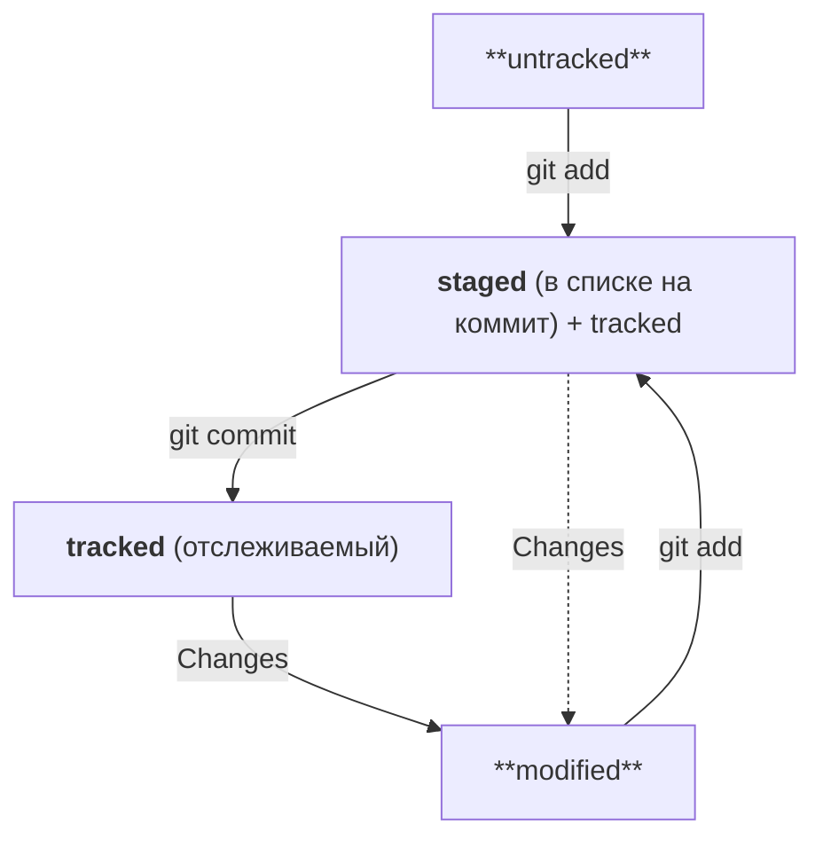

# Git Cheatlist

---------------------------------

## Главное

В командную строку нельзя вставить текст из буфера обмена с помощью привычного сочетания Ctrl+V. На Windows (в Git Bash) и Linux для этого используется сочетание Ctrl+Shift+V, а на macOS — Cmd+V.
Также можно нажать правую кнопку мыши и выбрать пункт Paste (англ. «вставить») в выпадающем меню.

Работая с консолью, мы всегда «находимся» в какой-то папке (это указано в строке над курсором). Если там написано `~`, то мы в папке пользователя (зависит от настроек Windows, чаще всего это `C:/Users/ВАШЕИМЯПОЛЬЗОВАТЕЛЯ/`), если там `/d/projects`, мы в папке `D:/projects`.

## Файловая система

### Просмотр содержимого папки

```bash
pwd                     # выводит текущи путь (сокращение от PRINT WORK DIRECTORY)
ls                      # показать содержимое папки
ls -l                   # отображает расширенную информацию о файлах и папках
ls -a                   # то же, но показывать и скрытые файлы и папки
ls -a -1                # то же, но в один столбец
ls -hF -1 --sort=extension # показать содержимое папки «красиво, в один столбец»
ls build/css            # показать содержимое папки ТЕКУЩАЯ_ПАПКА/build/css
ls /d/projects          # показать содержимое папки D:/projects
```

### Перемещение по файловой системе 

Пользователь всегда находится в какой-то папке, она (или полный путь) всегда показана до области ввода команд. 

```bash

cd projects             # переход в папку projects, которая есть текущей папке
cd /d/projects          # windows: переход в папку projects, расположенную по адресу D:/projects 
cd /c/Program\ Files    # windows: переход в C/:Program Files 
cd .                    # текущая директория
cd ..                   # переход к родительской папке 
cd ~                    # домашняя директория
cd -                    # переход к последней рабочей папке
```

Чтобы не набирать имя папки целиком, наберите первые пару символов и нажмите <kbd>Tab</kbd> — произойдет автодополнение (если нет двух папок, начинающихся с введенных символов, иначе будут показаны сами эти папки). Справедливо для любой команды.

### Создание папок и файлов

```bash
mkdir project                        # создать папку с именем «project»
mkdir project project/css project/js # создать несколько папок
mkdir -p project/{css,js}            # то же, что выше

touch index.html                     # создать файл
touch index.html css/style.css js/script.js # создать файлы (папки css/ и js/ должны уже существовать)
```

### Копирование файлов

```bash
cp index.html catalog.html # копирование файла index.html в тот же каталог с переименованием в catalog.html
cp index.html old/         # копирование файла index.html в папку old/ (все произойдет в текущей папке)
cp temp/ temp2/ -r         # дублирование каталога
```


### Переименование или перемещение файлов

```bash
mv index.html old              # перемещение файла в папку
mv index.html old/new_name.txt # перемещение файла в папку с переименованием файла
mv order.txt orderNew.txt      # переименовать файл
```


### Удаление папок и файлов

```bash
rm ghost.png             # удалить файл
rm -rf old               # удалить папку и всё из нее
```

## Связываем локальный и удалённый репозитории
### Инициализируем репозиторий

```bash
$ cd ~/dev/first-project # перешли в нужную папку

$ git init # создали репозиторий
```
Не рекомендуется создавать репозиторий Git внутри другого Git-репозитория. Это может вызывать проблемы с отслеживанием изменений.
В некоторых случаях при инициализации репозитория Git может показать объёмное сообщение, которое начинается со слов Using 'master' as the name…. 

Также git init выведет сообщение вида Initialized empty Git repository in <*ваша папка с проектом*>/.git/ (англ. «инициализирован пустой Git-репозиторий в <*ваша папка*>/.git/»). В подпапке .git Git будет хранить всю служебную информацию.

Если вы случайно сделали Git-репозиторием не ту папку, её можно «разгитить». Для этого нужно удалить скрытую подпапку .git.

```bash
$ cd <папка с репозиторием> # перешли в папку

$ rm -rf .git # удалили подпапку .git
```

Команда git status выведет:

- название текущей ветки: On branch master или On branch main;
- сообщение о том, что в репозитории ещё нет коммитов: No commits yet;
- сообщение, которое говорит: «чтобы что-нибудь закоммитить (то есть зафиксировать), нужно сначала это создать» — nothing to commit (create/copy files and use "git add" to track).

```bash
$ git add --all # подготовили к сохранению все файлы в репозитории
$ git status # проверили статус 

$ git add todo.txt
$ git add readme.txt
$ git status 

$ git add . # добавить всю текущую папку
$ git status 
```

Команда git add не сохраняет содержимое файлов в репозитории. Само сохранение, или фиксацию состояния файлов, называют коммитом (от англ. commit — «совершать», «фиксировать»). «Сделать коммит» значит сохранить текущую версию файла. 

Сделать коммит можно командой git commit c ключом -m (от англ. message — «сообщение»), который присваивает коммиту сообщение.
Обычно в таком сообщении поясняется, в чём именно состояли изменения. Это как заметки на полях: благодаря им проще читать и понимать текст. Сообщение коммита выполняет те же функции — улучшает понимание и упрощает навигацию. Оно пишется после ключа -m в кавычках.

```bash
$ git commit -m 'Мой первый коммит!' 
```

### Удаленный репозиторий

1. Создаем репозиторий. Для этого переходим на вкладку Repositories, а затем нажмимаем на зелёную кнопку New справа.

2. Открылось окно создания нового репозитория. Название удалённого репозитория необязательно должно совпадать с именем папки проекта у нас на компьютере. 

3. Другие поля нам пока не понадобятся. Смело нажимаем на зелёную кнопку Create repository внизу.

Осталось связать удалённый репозиторий с локальным, который уже есть на компьютере. GitHub предоставляет для этого инструкцию (пункт …or push an existing repository from the command line).
Но прежде, чтобы упростить работу с GitHub и сделать её более безопасной, надо научиться генерировать **SSH-ключи** (от англ. Secure Shell — «безопасная оболочка»). 

SSH использует пару ключей для обеспечения безопасности — публичный и приватный:

- Приватный ключ (англ. private key) хранится только на вашем компьютере и не должен передаваться кому-либо ещё. Он используется для расшифровки данных.

- Публичный ключ (англ. public key) доступен всем и используется для шифрования данных. Они могут быть расшифрованы парным приватным ключом. 

```bash
$ cd ~ # перешли в домашнюю директорию 
$ ls -la .ssh/ # eсли папка пустая или её нет, всё в порядке

$ ssh-keygen -t ed25519 -C "электронная почта, к которой привязан ваш аккаунт на GitHub"  #  eсли вы видите сообщение об ошибке, то, скорее всего, ваша система не поддерживает алгоритм шифрования ed25519. Ничего страшного: используйте другой алгоритм
$ ssh-keygen -t rsa -b 4096 -C "электронная почта, к которой привязан ваш аккаунт на GitHub"
> Generating public/private rsa key pair. # сгенерированы публичный и приватный ключи
> Enter a file in which to save the key (C:\Users\<имя_пользователя>\.ssh\):[Press enter]  # windows
> Enter a file in which to save the key (/Users/you/.ssh/id_rsa): [Press enter] # macOs
> Enter passphrase (empty for no passphrase): [Type a passphrase] # Программа запросит кодовую фразу (англ. passphrase) для доступа к SSH-ключу. Вы можете оставить поле пустым
> Enter same passphrase again: [Type passphrase again] 
$ ls -a ~/.ssh # должны появиться два файла — один с расширением .pub, другой — без.
# скопировать содержимое ключа в буфер обмена (macOs):
$ pbcopy < ~/.ssh/id_rsa.pub
# для ed25519:
$ pbcopy < ~/.ssh/id_ed25519.pub 
# скопировать содержимое ключа в буфер обмена (windows):
$ clip < ~/.ssh/id_rsa.pub
# для ed25519:
$ clip < ~/.ssh/id_ed25519.pub 
#Если clip не сработает, выведите содержимое файла с помощью cat ~/.ssh/id_rsa.pub или cat ~/.ssh/id_ed25519.pub и скопируйте вывод в буфер обмена из консоли.
```

Перейдите на GitHub и выберите пункт Settings в меню аккаунта. В меню слева нажмите на пункт SSH and GPG keys. В открывшейся вкладке выберите New SSH key (англ. «новый SSH-ключ»). В поле Title (англ. «заголовок») напишите название ключа. Например, Personal key (англ. «личный ключ»). В поле Key type (англ. «тип ключа») должно быть Authentication Key (англ. «ключ аутентификации»). В поле Key скопируйте ваш ключ из буфера обмена. Нажмите на кнопку Add SSH key (англ. «добавить SSH-ключ»).
Проверьте правильность ключа с помощью следующей команды.

```bash
$ ssh -T git@github.com
```

Перейдите на страницу удалённого репозитория, выберите тип SSH и скопируйте URL. Кнопка справа позволит сделать это мгновенно. Откройте консоль, перейдите в каталог локального репозитория и введите команду git remote add.

```bash
$ cd ~/dev/first-project
$ git remote add origin git@github.com:%ИМЯ_АККАУНТА%/first-project.git
```
убедимся, что всё работает, с помощью следующей команды.

```bash
$ git remote -v
origin    git@github.com:%ИМЯ_АККАУНТА%/%ИМЯ-ПРОЕКТА%.git (fetch)
origin    git@github.com:%ИМЯ_АККАУНТА%/%ИМЯ-ПРОЕКТА%.git (push)
```

Самая первая ветка в репозитории появляется автоматически и называется main (англ. «основная») или master. Её имя нужно указывать при отправке коммитов на удалённый репозиторий или при получении их из него.

```bash
$ git push -u origin main # Если команда приведёт к ошибке, попробуйте 
                          # заменить main на master. 
```

## Навигация по коммитам

Информация о коммите — это набор данных: когда был сделан коммит, содержимое файлов в репозитории на момент коммита и ссылка на предыдущий, или родительский (англ. parent), коммит.

Обычно хеш — это короткая (40 символов в случае SHA-1) строка, которая состоит из цифр 0—9 и латинских букв A—F (неважно, заглавных или строчных). Она обладает следующими важными свойствами:

-если хеш получить дважды для одного и того же набора входных данных, то результат будет гарантированно одинаковый;

-если хоть что-то в исходных данных поменяется (хотя бы один символ), то хеш тоже изменится (причём сильно).

После вызова git log появляется список коммитов.

Получить сокращённый лог можно с помощью команды git log с флагом --oneline (англ. «одной строкой»). В терминале появятся только первые несколько символов хеша каждого коммита и их комментарии. Команда подбирает такую длину сокращённых хешей, чтобы они были уникальными в пределах репозитория.

Файл HEAD — один из служебных файлов папки .git. Он указывает на коммит, который сделан последним (то есть на самый новый). Если нужно передать последний коммит, то вместо его хеша можно просто написать слово HEAD — Git поймёт, что вы имели в виду последний коммит.


## Статусы файлов в Git

- Статусом untracked помечается файл, о существовании которого Git знает, но не следит за изменениями в нём. Этот статус — противоположность tracked, в который попадают все файлы, отслеживаемые Git.

- Файл переходит в статус staged после выполнения git add.

- Статус modified означает, что файл был изменён.

- Большинство файлов в проектах «шагает» по следующему циклу: «изменён» → «добавлен в список на коммит» → «закоммичен» → «изменён» → и так далее.

[Оформление диаграмы](https://mermaid.js.org/syntax/flowchart.html)



1. Файл только что создали. Git ещё не отслеживает содержимое этого файла. Состояние: untracked.

2. Файл добавили в staging area с помощью git add. Состояние: staged (+ tracked).

- Возможно, изменили файл ещё раз. Состояния: staged, modified (+ tracked).
- Обратите внимание: staged и modified у одного файла, но у разных его версий.
- Ещё раз выполнили git add. Состояние: staged (+ tracked).

3. Сделали коммит с помощью git commit. Состояние: tracked.

4. Изменили файл. Состояние: modified (+ tracked).

5. Снова добавили в staging area с помощью git add. Состояния: staged (+ tracked).

6. Сделали коммит. Состояния: tracked.

7. Повторили пункты 4−7 много-много раз.

Команда git status показывает только следующие состояния файлов:

- **staged** (Changes to be committed в выводе git status);
- **modified** (Changes not staged for commit);
- **untracked** (Untracked files).

Коммиты должны быть хорошо читаемы, информативны, в одном стиле. Иногда указывается номер задачи, используются инфинитивы, а в английском языке - повелительное наклонение.

